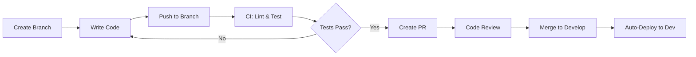

# 🚀 CI/CD Pipeline Documentation

**Complete guide to the automated CI/CD workflows for VPN Enterprise**

---

## Table of Contents

- [Overview](#overview)
- [Workflows](#workflows)
- [Setup & Configuration](#setup--configuration)
- [Usage Guide](#usage-guide)
- [Secrets Management](#secrets-management)
- [Deployment Strategies](#deployment-strategies)
- [Monitoring & Rollback](#monitoring--rollback)
- [Troubleshooting](#troubleshooting)
- [Best Practices](#best-practices)

---

## Overview

The VPN Enterprise CI/CD pipeline provides automated testing, building, security scanning, and deployment for all microservices. Built on GitHub Actions with production-ready practices.

### Key Features

✅ **Automated Testing** - Unit, integration, and E2E tests  
✅ **Multi-service Support** - Independent workflows per service  
✅ **Security Scanning** - SAST, dependency, container, and secret scanning  
✅ **Zero-downtime Deployments** - Blue-green and rolling update strategies  
✅ **Environment Management** - Dev, Staging, Production environments  
✅ **Automated Releases** - Semantic versioning with changelogs  
✅ **Docker Build & Push** - Multi-platform image builds  
✅ **Rollback Support** - Quick recovery from failed deployments

### Architecture

```
┌─────────────────────────────────────────────────────────┐
│                    GitHub Actions                        │
└─────────────────────────────────────────────────────────┘
                            │
        ┌───────────────────┼───────────────────┐
        │                   │                   │
   ┌────▼─────┐      ┌─────▼──────┐    ┌──────▼──────┐
   │   Lint   │      │    Test    │    │   Security  │
   │  & Type  │      │  Services  │    │   Scanning  │
   │  Check   │      │            │    │             │
   └────┬─────┘      └─────┬──────┘    └──────┬──────┘
        │                  │                   │
        └──────────────────┼───────────────────┘
                           │
                    ┌──────▼───────┐
                    │  Build Docker│
                    │    Images    │
                    └──────┬───────┘
                           │
            ┌──────────────┼──────────────┐
            │              │              │
      ┌─────▼─────┐  ┌────▼─────┐  ┌────▼──────┐
      │    Dev    │  │ Staging  │  │Production │
      │  Deploy   │  │  Deploy  │  │  Deploy   │
      └───────────┘  └──────────┘  └───────────┘
```

---

## Workflows

### 1. Main CI/CD Pipeline

**File:** `.github/workflows/main-ci-cd.yml`

**Triggers:**

- Push to `main`, `develop`, `staging` branches
- Pull requests
- Manual dispatch

**Jobs:**

1. **Setup** - Detect changed services, calculate versions
2. **Lint** - ESLint, TypeScript checks, Python linting
3. **Test** - Unit and integration tests with PostgreSQL/Redis
4. **Build** - Docker image builds for all services
5. **Security** - Trivy vulnerability scanning
6. **Deploy** - Environment-specific deployments
7. **Post-Deploy** - Health checks, notifications

**Usage:**

```bash
# Automatic on push
git push origin main

# Manual trigger
gh workflow run main-ci-cd.yml -f environment=production -f skip_tests=false
```

### 2. Docker Build & Publish

**File:** `.github/workflows/docker-build.yml`

**Triggers:**

- Version tags (v*.*.\*)
- Manual dispatch

**Jobs:**

1. **Build** - Multi-platform Docker builds (amd64, arm64)
2. **Verify** - Image validation and size checks
3. **Trigger Deploy** - Automatic deployment on tags
4. **Cleanup** - Remove old untagged images

**Services Built:**

- `api` - Node.js API server
- `web` - Next.js web dashboard
- `python-api` - FastAPI service
- `database-manager` - Database management service
- `tenant-provisioner` - Tenant provisioning service
- `nginx` - Reverse proxy

**Usage:**

```bash
# Build all services
gh workflow run docker-build.yml -f services=all -f push_images=true

# Build specific services
gh workflow run docker-build.yml -f services=api,web -f push_images=true

# Build without pushing (testing)
gh workflow run docker-build.yml -f services=all -f push_images=false
```

### 3. Environment Deployment

**File:** `.github/workflows/deploy-env.yml`

**Triggers:**

- Manual dispatch only (controlled deployments)

**Environments:**

- **Development** - https://dev.chatbuilds.com
- **Staging** - https://staging.chatbuilds.com
- **Production** - https://chatbuilds.com

**Deployment Strategies:**

- **Development:** Direct deployment with hot reload
- **Staging:** Rolling updates with health checks
- **Production:** Blue-green deployment with zero downtime

**Usage:**

```bash
# Deploy to development
gh workflow run deploy-env.yml \
  -f environment=development \
  -f services=all \
  -f version=latest

# Deploy specific service to staging
gh workflow run deploy-env.yml \
  -f environment=staging \
  -f services=api \
  -f version=v1.2.3

# Rollback production
gh workflow run deploy-env.yml \
  -f environment=production \
  -f rollback=true
```

### 4. Security Scanning

**File:** `.github/workflows/security-scan.yml`

**Triggers:**

- Push to main branches
- Pull requests
- Daily schedule (2 AM UTC)
- Manual dispatch

**Scans:**

1. **Secret Scanning** - TruffleHog, Gitleaks
2. **Dependency Scanning** - npm audit, Snyk, Safety (Python)
3. **SAST** - CodeQL, Semgrep
4. **Container Scanning** - Trivy, Grype, Snyk
5. **IaC Scanning** - Checkov, Hadolint
6. **License Compliance** - license-checker
7. **SBOM Generation** - CycloneDX

**Usage:**

```bash
# Manual security scan
gh workflow run security-scan.yml
```

### 5. Release Automation

**File:** `.github/workflows/release.yml`

**Triggers:**

- Manual dispatch only

**Features:**

- Semantic versioning (major.minor.patch)
- Automatic changelog generation
- GitHub release creation
- Docker image tagging
- Release asset packaging
- Post-release notifications

**Usage:**

```bash
# Create patch release (1.2.3 → 1.2.4)
gh workflow run release.yml -f version_bump=patch

# Create minor release (1.2.3 → 1.3.0)
gh workflow run release.yml -f version_bump=minor

# Create major release (1.2.3 → 2.0.0)
gh workflow run release.yml -f version_bump=major

# Pre-release
gh workflow run release.yml -f version_bump=minor -f prerelease=true

# Generate changelog only (no release)
gh workflow run release.yml -f version_bump=minor -f changelog_only=true
```

---

## Setup & Configuration

### Required GitHub Secrets

#### Deployment Secrets

```bash
# Development
DEV_DEPLOY_HOST=dev.example.com
DEV_DEPLOY_USER=deploy
DEV_DEPLOY_SSH_KEY=<private-key>

# Staging
STAGING_DEPLOY_HOST=staging.example.com
STAGING_DEPLOY_USER=deploy
STAGING_DEPLOY_SSH_KEY=<private-key>

# Production
PROD_DEPLOY_HOST=prod.example.com
PROD_DEPLOY_USER=deploy
PROD_DEPLOY_SSH_KEY=<private-key>

# Generic (if using single host)
DEPLOY_HOST=example.com
DEPLOY_USER=deploy
DEPLOY_SSH_KEY=<private-key>
DEPLOY_PORT=22
```

#### Registry & Vercel

```bash
# GitHub Container Registry (automatic)
GITHUB_TOKEN=<auto-provided>

# Docker Hub (optional)
DOCKERHUB_USERNAME=your-username
DOCKERHUB_TOKEN=<access-token>

# Vercel
VERCEL_TOKEN=<vercel-token>
VERCEL_ORG_ID=<org-id>
VERCEL_PROJECT_ID=<project-id>
```

#### Security Tools

```bash
# Snyk
SNYK_TOKEN=<snyk-api-token>

# CodeCov
CODECOV_TOKEN=<codecov-token>

# Gitleaks (optional)
GITLEAKS_LICENSE=<license-key>
```

#### Notifications

```bash
# Slack
SLACK_WEBHOOK=<webhook-url>
SECURITY_SLACK_WEBHOOK=<security-webhook-url>
```

### Setting Secrets

#### Via GitHub CLI

```bash
# Set a secret
gh secret set SECRET_NAME

# Set from file
gh secret set DEPLOY_SSH_KEY < ~/.ssh/deploy_key

# Set for specific environment
gh secret set DATABASE_URL --env production
```

#### Via GitHub UI

1. Go to repository **Settings** → **Secrets and variables** → **Actions**
2. Click **New repository secret**
3. Add name and value
4. Save

### Environment Configuration

#### Create Environments

1. Go to **Settings** → **Environments**
2. Create environments: `development`, `staging`, `production`
3. Configure protection rules:
   - **Production:** Required reviewers, branch restrictions
   - **Staging:** Branch restrictions
   - **Development:** No restrictions

#### Environment URLs

```yaml
development:
  url: https://dev.chatbuilds.com

staging:
  url: https://staging.chatbuilds.com

production:
  url: https://chatbuilds.com
```

---

## Usage Guide

### Development Workflow



**Steps:**

1. Create feature branch: `git checkout -b feature/new-feature`
2. Write code and commit
3. Push: `git push origin feature/new-feature`
4. CI runs automatically (lint, test, security scan)
5. Create Pull Request
6. After approval, merge to `develop`
7. Auto-deploys to development environment

### Staging Deployment

```bash
# 1. Merge develop to staging
git checkout staging
git merge develop
git push origin staging

# 2. Wait for CI to complete

# 3. Manually trigger deployment if needed
gh workflow run deploy-env.yml \
  -f environment=staging \
  -f services=all \
  -f version=latest
```

### Production Release

```bash
# 1. Create release
gh workflow run release.yml -f version_bump=minor

# 2. Release workflow will:
#    - Calculate new version
#    - Generate changelog
#    - Build Docker images
#    - Create GitHub release
#    - Tag images
#    - Trigger staging deployment

# 3. After staging validation, deploy to production
gh workflow run deploy-env.yml \
  -f environment=production \
  -f services=all \
  -f version=v1.2.0

# 4. Monitor deployment
gh run watch

# 5. If issues arise, rollback
gh workflow run deploy-env.yml \
  -f environment=production \
  -f rollback=true
```

### Hotfix Process

```bash
# 1. Create hotfix branch from main
git checkout -b hotfix/critical-bug main

# 2. Fix the bug
git add .
git commit -m "fix: critical security issue"

# 3. Push and create PR
git push origin hotfix/critical-bug

# 4. After CI passes and review, merge to main
git checkout main
git merge hotfix/critical-bug

# 5. Create patch release
gh workflow run release.yml -f version_bump=patch

# 6. Deploy to production immediately
gh workflow run deploy-env.yml \
  -f environment=production \
  -f services=all \
  -f version=<new-version>

# 7. Back-merge to develop
git checkout develop
git merge main
git push origin develop
```

---

## Secrets Management

### Secrets Priority

1. **Environment secrets** (highest priority)
2. **Repository secrets**
3. **Organization secrets** (if applicable)

### Rotating Secrets

```bash
# 1. Generate new secret
ssh-keygen -t ed25519 -f new_deploy_key

# 2. Update on server
ssh user@server "echo '$(cat new_deploy_key.pub)' >> ~/.ssh/authorized_keys"

# 3. Update in GitHub
gh secret set DEPLOY_SSH_KEY < new_deploy_key

# 4. Test deployment
gh workflow run deploy-env.yml -f environment=development -f services=api

# 5. Remove old key from server
ssh user@server "vi ~/.ssh/authorized_keys"  # Remove old key

# 6. Delete local keys
shred -u new_deploy_key*
```

### Secrets Checklist

- [ ] Rotate every 90 days
- [ ] Use separate keys per environment
- [ ] Never commit secrets to repository
- [ ] Use GitHub secrets, not environment files
- [ ] Enable secret scanning
- [ ] Monitor secret access logs

---

## Deployment Strategies

### Development (Direct Deployment)

**Strategy:** Replace containers immediately  
**Downtime:** Acceptable (dev environment)  
**Rollback:** Git revert + redeploy

```yaml
deploy:
  strategy: direct
  health_check: optional
  monitoring: basic
```

### Staging (Rolling Update)

**Strategy:** One service at a time  
**Downtime:** Minimal (5-10 seconds per service)  
**Rollback:** Previous image version

```yaml
deploy:
  strategy: rolling
  max_surge: 1
  max_unavailable: 0
  health_check: required
  monitoring: full
```

**Process:**

1. Pull new image
2. Start new container
3. Wait for health check (15s)
4. Stop old container
5. Verify service
6. Repeat for next service

### Production (Blue-Green)

**Strategy:** Run old and new versions simultaneously  
**Downtime:** Zero  
**Rollback:** Switch traffic back to old version

```yaml
deploy:
  strategy: blue-green
  traffic_switch: gradual (canary)
  health_check: strict
  monitoring: comprehensive
  rollback: automatic on failure
```

**Process:**

1. Deploy new version (green) alongside old (blue)
2. Both versions running simultaneously
3. Health checks on green deployment
4. Gradually shift traffic to green (10% → 50% → 100%)
5. Monitor metrics (errors, latency)
6. If successful, decommission blue
7. If failure detected, instant rollback to blue

### Canary Deployment (Advanced)

For gradual rollouts to production:

```bash
# Deploy to 10% of servers
gh workflow run deploy-env.yml \
  -f environment=production \
  -f services=api \
  -f version=v1.2.0 \
  -f canary_percentage=10

# Monitor for issues
# After validation, increase to 50%
gh workflow run deploy-env.yml \
  -f environment=production \
  -f services=api \
  -f version=v1.2.0 \
  -f canary_percentage=50

# Finally, complete rollout
gh workflow run deploy-env.yml \
  -f environment=production \
  -f services=api \
  -f version=v1.2.0 \
  -f canary_percentage=100
```

---

## Monitoring & Rollback

### Deployment Monitoring

```bash
# Watch workflow execution
gh run watch

# View workflow logs
gh run view

# List recent runs
gh run list --workflow=main-ci-cd.yml

# Check deployment status
curl https://chatbuilds.com/health
```

### Health Check Endpoints

```bash
# API health
curl https://chatbuilds.com/api/health

# Web health
curl https://chatbuilds.com/

# Python AI health
curl https://chatbuilds.com/ai/health

# Detailed status
curl https://chatbuilds.com/api/status
```

### Automated Rollback Triggers

The pipeline automatically rolls back if:

- Health check fails after deployment
- Error rate > 5% within 5 minutes
- Response time > 5 seconds
- Container restart count > 3

### Manual Rollback

```bash
# Method 1: Rollback via workflow
gh workflow run deploy-env.yml \
  -f environment=production \
  -f rollback=true

# Method 2: Deploy previous version
gh workflow run deploy-env.yml \
  -f environment=production \
  -f version=v1.1.9  # Previous version

# Method 3: SSH and manual rollback
ssh deploy@prod.example.com
cd /opt/vpn-enterprise
git checkout v1.1.9
docker compose down
docker compose up -d
```

### Post-Rollback

1. Identify root cause
2. Create hotfix branch
3. Test thoroughly in staging
4. Deploy hotfix
5. Document incident

---

## Troubleshooting

### Common Issues

#### 1. Workflow Fails to Trigger

**Problem:** Push doesn't trigger workflow

**Solution:**

```bash
# Check branch name matches workflow trigger
git branch

# Manually trigger
gh workflow run main-ci-cd.yml

# Check workflow file syntax
yamllint .github/workflows/main-ci-cd.yml
```

#### 2. Docker Build Fails

**Problem:** Docker build errors or timeouts

**Solution:**

```bash
# Check Dockerfile locally
docker build -f infrastructure/docker/Dockerfile.api .

# View build logs
gh run view --log-failed

# Clear build cache
docker builder prune
```

#### 3. Deployment Fails

**Problem:** SSH connection or deployment script errors

**Solution:**

```bash
# Test SSH connection
ssh -i ~/.ssh/deploy_key deploy@host.example.com

# Check secrets are set
gh secret list

# View deployment logs
gh run view --log

# Check server status
ssh deploy@host "docker ps"
```

#### 4. Tests Fail in CI

**Problem:** Tests pass locally but fail in CI

**Solution:**

```bash
# Run tests with same environment as CI
docker compose -f docker-compose.test.yml up

# Check PostgreSQL/Redis connectivity
docker logs vpn-postgres
docker logs vpn-redis

# View test logs
gh run view --job=test --log
```

#### 5. Security Scan Failures

**Problem:** Vulnerabilities detected

**Solution:**

```bash
# View security results
gh run view --job=security-scan

# Update dependencies
npm update
npm audit fix

# Check specific CVE
npm audit

# Override false positives (use cautiously)
npm audit --audit-level=critical
```

### Debug Mode

Enable detailed logging:

```yaml
# In workflow file
env:
  ACTIONS_STEP_DEBUG: true
  ACTIONS_RUNNER_DEBUG: true
```

---

## Best Practices

### Branch Strategy

```
main (production)
  ├── staging
  │     └── develop (development)
  │           ├── feature/new-feature
  │           ├── feature/another-feature
  │           └── bugfix/fix-issue
  └── hotfix/critical-bug
```

**Rules:**

- `main` - Always deployable to production
- `staging` - Pre-production testing
- `develop` - Integration branch
- `feature/*` - New features
- `bugfix/*` - Bug fixes
- `hotfix/*` - Production hotfixes

### Commit Messages

Follow [Conventional Commits](https://www.conventionalcommits.org/):

```bash
# Features
git commit -m "feat(api): add user authentication"

# Bug fixes
git commit -m "fix(web): resolve navigation issue"

# Documentation
git commit -m "docs: update deployment guide"

# Chores
git commit -m "chore: update dependencies"

# Breaking changes
git commit -m "feat(api)!: change authentication flow

BREAKING CHANGE: API now requires OAuth2"
```

### Pull Request Checklist

- [ ] Code follows project style guide
- [ ] Tests added/updated
- [ ] Documentation updated
- [ ] Changelog updated (if applicable)
- [ ] CI passes
- [ ] Security scan passes
- [ ] Reviewed by team member
- [ ] Branch is up-to-date with base

### Deployment Checklist

**Pre-Deployment:**

- [ ] All tests pass
- [ ] Security scans clear
- [ ] Staging deployment successful
- [ ] Backup created
- [ ] Rollback plan ready
- [ ] Team notified
- [ ] Monitoring alerts configured

**During Deployment:**

- [ ] Monitor health checks
- [ ] Watch error rates
- [ ] Check response times
- [ ] Verify functionality

**Post-Deployment:**

- [ ] Run smoke tests
- [ ] Check monitoring dashboards
- [ ] Verify all services healthy
- [ ] Update documentation
- [ ] Notify stakeholders

### Security Best Practices

1. **Secrets:**
   - Use GitHub secrets, never hardcode
   - Rotate regularly (90 days)
   - Use least privilege principle
   - Separate secrets per environment

2. **Scanning:**
   - Run security scans on every PR
   - Review and fix high/critical vulnerabilities
   - Keep dependencies updated
   - Monitor security advisories

3. **Access Control:**
   - Require PR reviews
   - Use environment protection rules
   - Limit who can approve production deployments
   - Enable 2FA for all team members

4. **Compliance:**
   - Keep audit logs
   - Document all production changes
   - Regular security reviews
   - Incident response plan

---

## Additional Resources

### Documentation

- [GitHub Actions Docs](https://docs.github.com/en/actions)
- [Docker Build Push Action](https://github.com/docker/build-push-action)
- [Semantic Versioning](https://semver.org/)

### Internal Docs

- [Infrastructure Guide](../infrastructure/INFRASTRUCTURE_COMPLETE_GUIDE.md)
- [Packages Documentation](../packages/PACKAGES_COMPLETE_GUIDE.md)
- [API Documentation](../packages/api/README.md)
- [Web Dashboard Docs](../apps/web-dashboard/README.md)

### Support

- **Issues:** https://github.com/Mucrypt/vpn-enterprise/issues
- **Discussions:** https://github.com/Mucrypt/vpn-enterprise/discussions
- **Slack:** #devops channel

---

**Last Updated:** February 1, 2026  
**Maintained by:** VPN Enterprise DevOps Team 🚀
