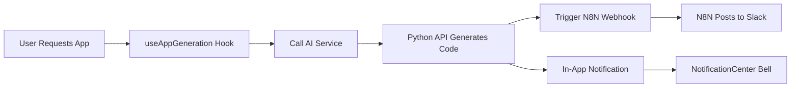
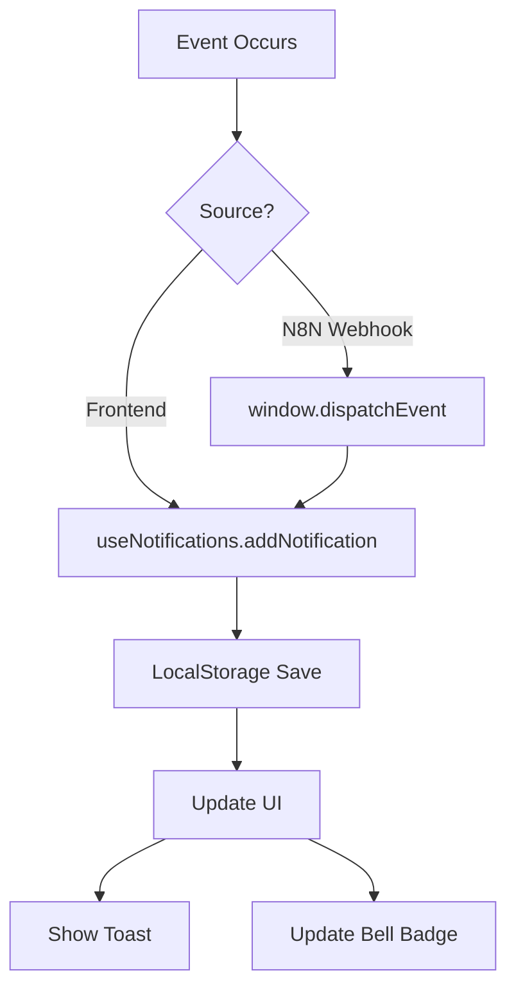
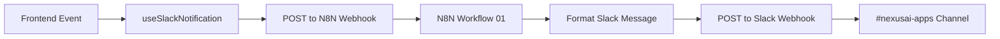

# NexusAI Frontend Updates - N8N & Slack Integration

## 🎉 What Was Added

### 1. **New Hooks** (Complete Export System)

**Created: [src/hooks/index.ts](src/hooks/index.ts)**

- Centralized hook exports
- All hooks available via single import: `import { useNotifications, useSlackNotification } from '@/hooks'`

**Created: [src/hooks/use-notifications.ts](src/hooks/use-notifications.ts)**

- Full in-app notification system
- LocalStorage persistence
- Cross-tab synchronization
- N8N webhook event listeners
- 5 notification types: info, success, warning, error
- Unread count tracking
- Auto-cleanup (max 50 notifications)

**Created: [src/hooks/use-slack-notification.ts](src/hooks/use-slack-notification.ts)**

- Send notifications through N8N to Slack
- Pre-built notification helpers:
  - `notifyAppGenerated()` - New app notifications
  - `notifyDeployment()` - Deployment status
  - `notifyError()` - Error alerts
  - `notifyCreditUsage()` - Credit warnings
- Rich Slack message formatting with blocks
- Action buttons in Slack messages

**Created: [src/hooks/use-app-generation.ts](src/hooks/use-app-generation.ts)**

- Complete app generation workflow
- Progress tracking (0-100%)
- Step-by-step updates
- Automatic Slack notifications
- Error handling with N8N webhooks
- Credit usage calculation

### 2. **New UI Components**

**Created: [src/components/NotificationCenter.tsx](src/components/NotificationCenter.tsx)**

- Bell icon with unread badge
- Dropdown notification panel
- "Mark all read" functionality
- "Clear all" button
- Animated bell icon when unread

**Created: [src/components/NotificationItem.tsx](src/components/NotificationItem.tsx)**

- Individual notification card
- Icon based on type (✓ success, ✗ error, ⚠ warning, ℹ info)
- Relative timestamp ("2 minutes ago")
- Action button with external link
- Unread indicator dot
- Delete functionality

**Created: [src/components/GenerationProgress.tsx](src/components/GenerationProgress.tsx)**

- Live progress bar during generation
- 5-step visualization:
  1. Analyzing requirements (10%)
  2. Generating code with AI (30%)
  3. Processing files (60%)
  4. Finalizing app (90%)
  5. Complete (100%)
- Animated checkmarks for completed steps
- Error state with red border
- Success animation on completion

**Created: [src/components/NotificationPanel.tsx](src/components/NotificationPanel.tsx)**

- Full-page notification view
- Search functionality
- 6 filter tabs: All, Unread, Success, Errors, Warnings, Info
- Notification counts on each tab
- "Mark all read" and "Clear all" actions
- Empty state graphics

### 3. **AI Service Integration**

**Updated: [src/services/aiService.ts](src/services/aiService.ts)**

Added N8N webhook integration:

```typescript
// New method
private async triggerN8NWebhook(webhookName: string, payload: any)

// Webhooks triggered on:
- generateFullApp() → nexusai-app-generated
- deployApp() → nexusai-deploy (success)
- deployApp() error → nexusai-error (failure)
```

Added environment variable:

```typescript
private n8nWebhookURL = import.meta.env.VITE_N8N_WEBHOOK_URL
```

### 4. **Environment Configuration**

**Created: [.env.example](.env.example)**

```bash
VITE_N8N_WEBHOOK_URL=http://localhost:5678/webhook
VITE_AI_API_URL=http://localhost:5001
VITE_PUBLIC_AI_API_URL=https://chatbuilds.com/api/ai
```

---

## 🔌 How It Works

### App Generation Flow



### Notification Flow



### Slack Integration Flow



---

## 📖 Usage Examples

### 1. Using Notifications in Components

```tsx
import { useNotifications } from '@/hooks'
import { NotificationCenter } from '@/components/NotificationCenter'

function MyComponent() {
  const { addNotification, unreadCount } = useNotifications()

  const handleAction = () => {
    addNotification({
      type: 'success',
      title: 'App Generated',
      message: 'Your React app is ready!',
      actionUrl: '/my-apps',
      actionLabel: 'View App',
    })
  }

  return (
    <div>
      <NotificationCenter /> {/* Add to navbar */}
      <button onClick={handleAction}>Generate App</button>
    </div>
  )
}
```

### 2. Using App Generation Hook

```tsx
import { useAppGeneration } from '@/hooks'
import { GenerationProgress } from '@/components/GenerationProgress'

function AppBuilder() {
  const { generateApp, isGenerating, progress, currentStep, error } =
    useAppGeneration()

  const handleGenerate = async () => {
    const result = await generateApp({
      description: 'E-commerce dashboard',
      framework: 'react',
      features: ['auth', 'payments'],
      styling: 'tailwind',
    })

    if (result) {
      // App generated successfully
      // Slack notification sent automatically
      console.log('Generated files:', result.files)
    }
  }

  return (
    <div>
      <button onClick={handleGenerate} disabled={isGenerating}>
        Generate App
      </button>

      <GenerationProgress
        isGenerating={isGenerating}
        progress={progress}
        currentStep={currentStep}
        error={error}
      />
    </div>
  )
}
```

### 3. Sending Custom Slack Notifications

```tsx
import { useSlackNotification } from '@/hooks'

function DeployButton({ appId }) {
  const { notifyDeployment } = useSlackNotification()

  const handleDeploy = async () => {
    try {
      // Deploy app...
      await deployApp(appId)

      // Notify Slack
      await notifyDeployment({
        app_id: appId,
        app_name: 'My App',
        status: 'success',
        url: 'https://myapp.com',
      })
    } catch (error) {
      // Error notification sent automatically
    }
  }

  return <button onClick={handleDeploy}>Deploy</button>
}
```

### 4. Full Notification Panel Page

```tsx
import { NotificationPanel } from '@/components/NotificationPanel'

function NotificationsPage() {
  return (
    <div className='container mx-auto py-8'>
      <NotificationPanel />
    </div>
  )
}
```

---

## 🎨 Component Customization

### Notification Types

Each notification type has a distinct color and icon:

| Type      | Icon | Color  | Use Case                             |
| --------- | ---- | ------ | ------------------------------------ |
| `success` | ✓    | Green  | App generated, deployed successfully |
| `error`   | ✗    | Red    | Generation failed, API errors        |
| `warning` | ⚠    | Yellow | Low credits, quota warnings          |
| `info`    | ℹ    | Blue   | General updates, tips                |

### Styling

All components use Tailwind CSS and Radix UI primitives:

- Dark mode support
- Responsive design
- Accessible (ARIA labels, keyboard navigation)
- Smooth animations

---

## 🔗 Integration Points

### 1. Navigation Bar

Add to your navbar:

```tsx
<Navbar>
  <NotificationCenter /> {/* Add here */}
</Navbar>
```

### 2. App Builder Page

Replace old generation logic:

```tsx
import { useAppGeneration } from '@/hooks'
// Use instead of manual AI service calls
const { generateApp } = useAppGeneration()
```

### 3. Deployment Flow

Auto-notifications on deploy:

```tsx
// Notifications sent automatically
const result = await aiService.deployApp(request)
```

---

## 🧪 Testing Notifications

### Test In-App Notifications

```tsx
import { triggerNotification } from '@/hooks/use-notifications'

// Trigger test notification
triggerNotification({
  type: 'success',
  title: 'Test Notification',
  message: 'This is a test message',
})
```

### Test Slack Notifications

```bash
# Test N8N webhook directly
curl -X POST http://localhost:5678/webhook/nexusai-app-generated \
  -H "Content-Type: application/json" \
  -d '{
    "app_name": "Test App",
    "framework": "react",
    "files_count": 5
  }'
```

---

## 🚀 Production Deployment

### 1. Set Environment Variables

On your production server:

```bash
# In apps/nexusAi/chat-to-code-38/.env.production
VITE_N8N_WEBHOOK_URL=https://chatbuilds.com/n8n/webhook
VITE_AI_API_URL=https://chatbuilds.com/api/ai
```

### 2. Build Frontend

```bash
cd apps/nexusAi/chat-to-code-38
npm run build
```

### 3. Verify N8N Webhooks

Ensure these N8N webhook endpoints are active:

- `/webhook/nexusai-app-generated`
- `/webhook/nexusai-deploy`
- `/webhook/nexusai-error`

### 4. Test Integration

Generate a test app and verify:

- ✓ In-app notification appears
- ✓ Bell icon shows unread badge
- ✓ Slack message appears in #nexusai-apps
- ✓ Progress bar animates correctly

---

## 📊 Monitoring

### Notification Metrics

Track in your analytics:

- Notifications sent (by type)
- Slack webhook success rate
- Average notification read time
- Most common notification types

### Debug Mode

Enable verbose logging:

```tsx
// In useNotifications hook
console.log('Notification added:', notification)

// In useSlackNotification hook
console.log('Slack webhook response:', response)
```

---

## 🐛 Troubleshooting

### Notifications Not Appearing

1. Check localStorage quota:

```js
console.log(localStorage.getItem('nexusai_notifications'))
```

2. Verify event listeners:

```js
window.addEventListener('n8n-notification', (e) => {
  console.log('N8N notification received:', e.detail)
})
```

### Slack Messages Not Sending

1. Check N8N webhook URL:

```bash
echo $VITE_N8N_WEBHOOK_URL
```

2. Test webhook manually:

```bash
curl -X POST $VITE_N8N_WEBHOOK_URL/nexusai-app-generated \
  -H "Content-Type: application/json" \
  -d '{"test": true}'
```

3. Check N8N workflow status:

```bash
docker logs $(docker ps -qf "name=n8n") --tail 100
```

### Progress Bar Not Updating

Ensure `useAppGeneration` hook is used instead of direct AI service calls:

```tsx
// ❌ Don't do this
const result = await aiService.generateFullApp(request)

// ✓ Do this
const { generateApp } = useAppGeneration()
const result = await generateApp(request)
```

---

## 📚 Additional Resources

- [N8N Workflow JSON Files](../../n8n-workflows/)
- [Slack Setup Guide](../../n8n-workflows/SLACK_SETUP_GUIDE.md)
- [Python API Integration](../../../../flask/app_nexusai_production.py)
- [Deployment Guide](../../../../NEXUSAI_DEPLOYMENT_COMPLETE.md)

---

## ✨ What's Next?

### Planned Features

1. **Real-time Notifications** (WebSocket/SSE)
   - Live updates without page refresh
   - Push notifications

2. **Notification Settings**
   - Per-notification-type preferences
   - Email notification option
   - Quiet hours

3. **Rich Notifications**
   - Embedded previews
   - Inline actions
   - Code snippets

4. **Notification History Export**
   - Download as JSON/CSV
   - Filter by date range
   - Analytics dashboard

---

**Updated:** February 7, 2026  
**NexusAI Version:** 2.0 (N8N Integration)
